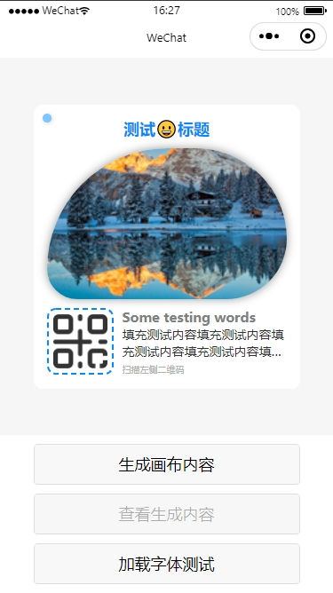
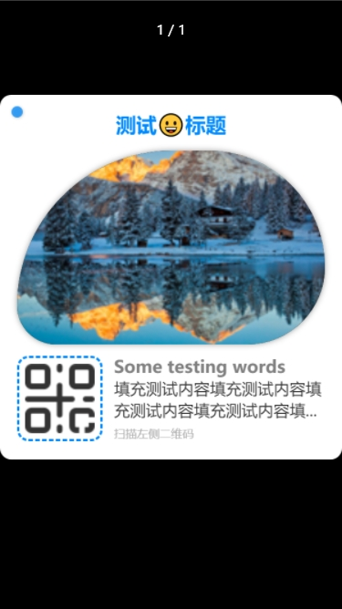

# wxml2canvas-2d

基于微信小程序 2D Canvas 的画布组件，根据给定 WXML 结构以及 CSS 样式快速转换成 Canvas 元素，以用于生成海报图片分享等操作。所见即所得（bushi

## 安装

### npm

使用 npm 构建前，请先阅读微信官方的 [npm 支持](https://developers.weixin.qq.com/miniprogram/dev/devtools/npm.html)

```bash
# 通过 npm 安装
npm i wxml2canvas-2d -S --production
```

### 构建 npm 包

打开微信开发者工具，点击 **工具** -> **构建 npm**，并勾选 **使用 npm 模块** 选项，构建完成后，即可引入组件。

## 使用

1. 在页面中编写 wxml 结构，将要生成画布内容的**根节点**用名为 `wxml2canvas-container` 的样式类名称标记，将该根节点内部**需要生成画布内容的节点**用名为 `wxml2canvas-item` 的样式类名称标记（文字类节点需在对应节点声明 `data-text` 属性，并传入文字内容）。上述两个样式类名称可以自定义，只需将对应名称传入 `wxml2canvas` 组件的对应属性参数即可；
```html
<view class="wxml2canvas-container box">
  <view class="wxml2canvas-item title" data-text="测试标题">测试标题</view>
  <image class="wxml2canvas-item image" src="/your-image-path.png" />
  <view class="wxml2canvas-item content" data-text="测试内容，长文本。。">测试内容，长文本。。</view>
</view>
<wxml2canvas id="wxml2canvas" />
```
2. 补充各个节点样式；
```css
.box { /* 根节点（容器）的样式 */ }
.title { /* 标题的样式 */ }
.image { /* 图片的样式 */ }
.content { /* 内容的样式 */ }
```
3. 依据 wxml 结构以及 css 样式，生成画布内容，并将生成结果导出。
```javascript
const canvas = this.selectComponent('#wxml2canvas');
await canvas.draw();
const filePath = await canvas.toTempFilePath();
```

## API

### 参数

||类型|说明|默认值|
|:-|:-|:-|:-|
|`containerClass`|`string`|根节点（容器）样式类名称|wxml2canvas-container|
|`itemClass`|`string`|内部节点样式类名称|wxml2canvas-item|
|`scale`|`number`|画布缩放比例|1|

### 外部样式类

||说明|
|:-|:-|
|`box-class`|`canvas` 节点样式类|

### 其他

<details>
  <summary><b>CSS 属性支持情况</b></summary>
  <br>

  > 基础属性：width，height，padding、margin 等布局相关属性不谈

  <table>
    <tr>
      <th colspan="2">属性</th>
      <th>说明</th>
    </tr>
    <tr>
      <td colspan="2">background</td>
      <td>背景，暂仅支持单一颜色</td>
    </tr>
    <tr>
      <td colspan="2">background-color</td>
      <td>背景颜色，支持</td>
    </tr>
    <tr>
      <td rowspan="3">border</td>
      <td>border-width</td>
      <td>边框宽度，暂仅支持四边同宽</td>
    </tr>
    <tr>
      <td>border-style</td>
      <td>边框样式，暂仅支持 solid 和 dashed</td>
    </tr>
    <tr>
      <td>border-color</td>
      <td>边框颜色，支持</td>
    </tr>
    <tr>
      <td colspan="2">opacity</td>
      <td>透明度，支持</td>
    </tr>
    <tr>
      <td colspan="2">box-shadow</td>
      <td>阴影，暂仅支持单一阴影</td>
    </tr>
    <tr>
      <td colspan="2">border-radius</td>
      <td>圆角，支持</td>
    </tr>
    <tr>
      <td colspan="2">font-family</td>
      <td>字体，支持</td>
    </tr>
    <tr>
      <td colspan="2">font-size</td>
      <td>字体大小，支持</td>
    </tr>
    <tr>
      <td colspan="2">font-weight</td>
      <td>字重，支持</td>
    </tr>
    <tr>
      <td colspan="2">text-align</td>
      <td>文本对齐，支持</td>
    </tr>
    <tr>
      <td colspan="2">line-height</td>
      <td>行高，支持</td>
    </tr>
    <tr>
      <td colspan="2">text-overflow</td>
      <td>文字溢出处理，支持</td>
    </tr>
    <tr>
      <td colspan="2">color</td>
      <td>文字颜色，支持</td>
    </tr>
  </table>
</details>
<br>
<details>
  <summary><b>TODOs</b></summary>
  <br>

  - [ ] 支持 background-image 等背景图片样式
  - [ ] 支持渐变类 background，Gradients
  - [ ] 支持多重 background，多重 box-shadow
</details>

## Demo

克隆本仓库，运行 `npm i & npm run dev`，将 miniprogram_dev 文件夹导入微信开发者工具

## 效果预览


